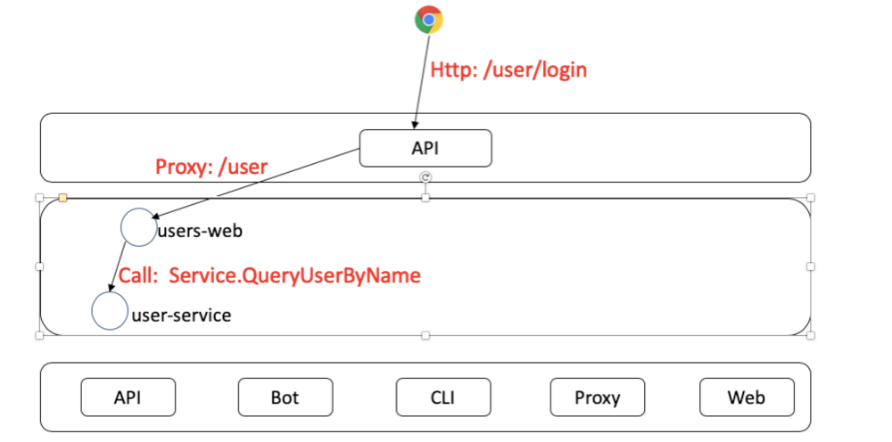

# GoMicroBookshop
A bookshop project for my go-micro and micro service learning

本项目依据项目 [micro-in-cn](https://github.com/micro-in-cn/tutorials/tree/master/microservice-in-micro) 进行学习。

## 目录

[TOC]

# 项目简介

## 业务模块

+ **用户**，users
+ **库存**，inventory
+ **权限**，auth
+ **订单**，orders
+ **支付**，payment

## 服务抽象结构


用户、订单、支付服务都会有对外暴露接口，故而它们各自有web层。web层app之间不会互相调用，它们只会与非web层的应用交互。

## 准备工作

- Golang环境 [安装](https://golang.google.cn/)
- gRPC [安装](https://grpc.io/docs/quickstart/go.html)
- Consul 
- Micro

```shell
## 安装go-micro
go get github.com/micro/go-micro

## 安装micro
go get github.com/micro/micro
```

- mysql

还有其它一些会用到的库或组件，但不是基础依赖，需要时再安装。

## 涉及技术与库

Golang，gRPC，Mysql，Redis，Docker，K8s，Go-micro/Micro

## 搭建平台

win10


# 章节

## 第一章 用户服务

本章节我们实现用户服务，用户服务分为两层，web层（user-web）与服务层（user-srv），前者提供http接口，后者向web提供RPC服务。

- user-web 以下简称**web**
- user-srv 以下简称**service**

**web**服务主要向用户提供如下接口

- 登录与token颁发
- 鉴权

我们不提供注册接口，一来增加不必要的代码量，我们的核心还是介绍如何使用Micro组件。

**server**服务主要向所有内部服务提供用户查询接口：

- 根据userName用户名查询用户

在开发应用之前，我们要先定义好命名空间。

| 服务      | 命名空间               | 说明                                                         |
| --------- | ---------------------- | ------------------------------------------------------------ |
| 接入层API | mu.micro.book.web      | 负责代理所有**mu.micro.book.web**下游的web应用，比如**mu.micro.book.web.user**等 |
| 用户web   | mu.micro.book.web.user | 接收API下放的路由为/user请求                                 |
| 用户服务  | mu.micro.book.srv.user | 对架构内应用提供user查询服务                                 |


### user-srv

user-srv的各组件如下表所示

| 启动顺序 | 组件    | 作用                                             |
| -------- | ------- | ------------------------------------------------ |
| 1        | basic   | 初始化配置与解析配置文件，初始化数据库等基础组件 |
| 2        | model   | 模型层，提供业务数据                             |
| 3        | handler | 接入层，提供对外接口，并向model层调用请求数据    |

Micro有提供代码生成器指令[**new**](https://github.com/micro-in-cn/all-in-one/tree/master/middle-practices/micro-new)，它可以新建服务模板代码，把基本所需的目录结构建好，省去大家挖坑的时间。

#### 新建模板

```shell
micro new --namespace=mu.micro.book --type=srv --alias=user github.com/YuxinZhaozyx/GoMicroBookshop/user-srv
```

模板生成在**user-srv**目录，其结构如下

```
.
├── main.go
├── plugin.go
├── handler
│   └── user.go
├── subscriber
│   └── user.go
├── proto/user
│   └── user.proto
├── Dockerfile
├── Makefile
└── README.md
```

修改后

```
.
├── main.go
├── plugin.go
├── basic
│   └── config               * 配置类
│   │   └── config.go        * 初始化配置类
│   │   └── consul.go        * consul配置结构体
│   │   └── mysql.go         * mysql配置结构体
│   │   └── profiles.go      * 配置文件树辅助类
│   └── db                   * 数据库相关
│   │    └── db.go           * 初始化数据库
│   │    └── mysql.go        * mysql数据库相关
│   └── basic.go             * 初始化基础组件
├── conf                     * 配置文件目录
├── handler
│   └── user.go              * 将名称改为user
├── model                    * 增加模型层，用于与数据库交换数据
│   └── user                 * 用户模型类
│   │   └── user.go          * 初始化用户模型类
│   │   └── user_get.go      * 封装获取用户数据类业务
│   └── model.go             * 初始化模型层
├── proto/user    
│   └── user.proto           * 将名称改为user
├── Dockerfile
├── Makefile
└── README.md
```

**目录解释：basic, model,  conf**

basic, model 目录与micro无关，只是为了实现MVC架构。

- **basic** 负责初始化基础组件，比如数据库、配置等
- **model** 负责封装业务逻辑
- **conf** 配置文件目录，现在我们还没用配置中心，暂先用文件的方式


#### 定义User原型

在user.proto中定义User原型，暂且定义以下字段，足够登录，显示用户基本信息、异常信息即可

```protobuf
syntax = "proto3";

package mu.micro.book.srv.user;

service User {
	rpc QueryUserByName(Request) returns (Response) {}
}

message user {
	int64 id = 1;
	string name = 2;
	string pwd = 3;
	uint64 createTime = 4;
	uint64 updateTime = 5;
}

message Error {
	int32 code = 1;
	string detail = 2;
}

message Request {
	string userID = 1;
	string userName = 2;
	string userPwd = 3;
}

message Response {
	bool success = 1;
	Error error = 2;
	user user = 3;
}
```

上面定义了User服务的基本原型结构，包含用户**User**，请求**Request**与响应结构**Response**，还定义了查询用户的方法**QueryUserByName**。

下面我们生成类型与服务方法：

```shell
protoc --proto_path=. --go_out=. --micro_out=. proto/user/user.proto
```

执行后会生成 proto/user/user.micro.go 和 proto/user/user.pb.go 两个文件。


#### 数据库与配置

##### 创建User表

选用MySQL作为数据库，以下是建表语句

```mysql
CREATE DATABASE `micro_book_mall` /*!40100 DEFAULT CHARACTER SET utf8mb4 COLLATE utf8mb4_bin */;
USE `micro_book_mall`;

CREATE TABLE `user`
(
    `id`           int(10) unsigned                                              NOT NULL AUTO_INCREMENT COMMENT '主键',
    `user_id`      int(10) unsigned                                                       DEFAULT NULL COMMENT '用户id',
    `user_name`    varchar(20) CHARACTER SET utf8mb4 COLLATE utf8mb4_0900_ai_ci  NOT NULL COMMENT '用户名',
    `pwd`          varchar(128) CHARACTER SET utf8mb4 COLLATE utf8mb4_0900_ai_ci NOT NULL COMMENT '密码',
    `created_time` timestamp(3)                                                  NOT NULL DEFAULT CURRENT_TIMESTAMP(3),
    `updated_time` timestamp(3)                                                  NOT NULL DEFAULT CURRENT_TIMESTAMP(3) ON UPDATE CURRENT_TIMESTAMP(3),
    PRIMARY KEY (`id`),
    UNIQUE KEY `user_user_name_uindex` (`user_name`),
    UNIQUE KEY `user_user_id_uindex` (`user_id`)
) ENGINE = InnoDB
  DEFAULT CHARSET = utf8mb4
  COLLATE = utf8mb4_bin COMMENT ='用户表';

INSERT INTO user (user_id, user_name, pwd) VALUE (10001, 'micro', '1234');
```

##### 基本组件配置

基础组件(basic)目前主要的功能是初始化配置与数据库。它的入口代码(basic/basic.go)是一个**Init**初始化方法，负责初始化其下所有组件。

```go
package basic

import (
	"github.com/YuxinZhaozyx/GoMicroBookshop/user-srv/basic/config"
	"github.com/YuxinZhaozyx/GoMicroBookshop/user-srv/basic/db"
)

func Init() {
	config.Init()
	db.Init()
}
```

##### 配置config

加载配置我们会使用到[go-config](https://github.com/micro/go-micro/config)里面的本地文件配置。相关示例可以参考[go-config示例](https://github.com/micro-in-cn/all-in-one/tree/master/basic-practices/micro-config)。

配置文件在 conf/ 文件夹下。

```shell
application.yml			# 根配置文件
application-db.yml		# 数据库配置文件
application-consul.yml	# consul服务发现配置文件
```

根配置文件application.yml如下

```yaml
app:
  profiles:
    include: consul, db
```

起名为**application.yml**是参考了Spring-boot风格。我们把consul和db配置分到独立的文件中。

通过解析`app.profiles.include`来加载指定的配置文件。当然也可以全部写在**application.yml**中，只是我觉得挤在一起的配置不优雅。

初始化配置的过程大致如下：

| 顺序 | 过程                | 说明                                                         |
| ---- | ------------------- | ------------------------------------------------------------ |
| 1    | 加载application.yml | 读取conf目录下application.yml文件                            |
| 2    | 解析profiles属性    | 如果有该属性则找到include值，该值就是指定需要引入的conf下的配置文件 |
| 3    | 解析include         | 解析出include配置【值】，并组合成文件名，文件名规则为[application-值.yml] |
| 4    | 读取include声明文件 | 读取配置文件值                                               |
| 5    | 解析配置            | 将配置文件中的值解析到配置对象中                             |

以下是它的核心代码(basic/config/config.go)

```go
// Init 初始化配置
func Init() {
	m.Lock()
	defer m.Unlock()

	if inited {
		log.Logf("[Init] 配置已经初始化过")
		return
	}

	// 加载yml配置
	// 先加载基础配置
	appPath, _ := filepath.Abs(filepath.Dir(filepath.Join("."+sp, sp)))

	pt := filepath.Join(appPath, "conf")
	os.Chdir(appPath)

	// 找到application.yml文件
	if err = config.Load(file.NewSource(file.WithPath(pt + sp + "application.yml"))); err != nil {
		panic(err)
	}

	// 找到需要引入的新配置文件
	if err = config.Get(defaultRootPath, "profiles").Scan(&profiles); err != nil {
		panic(err)
	}

	log.Logf("[Init] 加载配置文件：path: %s, %+v\n", pt+sp+"application.yml", profiles)

	// 开始导入新文件
	if len(profiles.GetInclude()) > 0 {
		include := strings.Split(profiles.GetInclude(), ",")

		sources := make([]source.Source, len(include))
		for i := 0; i < len(include); i++ {
			filePath := pt + string(filepath.Separator) + defaultConfigFilePrefix + strings.TrimSpace(include[i]) + ".yml"

			log.Logf("[Init] 加载配置文件：path: %s\n", filePath)

			sources[i] = file.NewSource(file.WithPath(filePath))
		}

		// 加载include的文件
		if err = config.Load(sources...); err != nil {
			panic(err)
		}
	}

	// 赋值
	config.Get(defaultRootPath, "consul").Scan(&consulConfig)
	config.Get(defaultRootPath, "mysql").Scan(&mysqlConfig)

	// 标记已经初始化
	inited = true
}
```

我们目前定义了三个配置结构，它们在basic的[config](./user-srv/basic/config)目录下

- [profiles](./user-srv/basic/config/profiles.go)
- [consul](./user-srv/basic/config/consul.go)
- [mysql](./user-srv/basic/config/mysql.go)：

```go
// defaultProfiles 属性配置文件
type defaultProfiles struct {
    Include string `json:"include"`
}

// defaultConsulConfig 默认consul 配置
type defaultConsulConfig struct {
    Enabled bool   `json:"enabled"`
    Host    string `json:"host"`
    Port    int    `json:"port"`
}

// defaultMysqlConfig mysql 配置
type defaultMysqlConfig struct {
    URL               string `json:"url"`
    Enable            bool   `json:"enabled"`
    MaxIdleConnection int    `json:"maxIdleConnection"`
    MaxOpenConnection int    `json:"maxOpenConnection"`
}
```

##### 数据库初始化

```go
// user-srv/basic/db/db.go
package db

import (
	"database/sql"
	"fmt"
	"sync"

	"github.com/YuxinZhaozyx/GoMicroBookshop/user-srv/basic/config"
	"github.com/micro/go-micro/util/log"
)

var (
	inited bool
	mysqlDB *sql.DB
	m sync.RWMutex
)

// Init 初始化数据库
func Init() {
	m.Lock()
	defer m.Unlock()

	var err error
	
	if inited{
		err = fmt.Errorf("[Init] db 已经初始化过了")
		log.Logf(err.Error())
		return
	}

	// 如果配置声明使用mysql
	if config.GetMysqlConfig().GetEnabled(){
		initMysql()
	}

	inited = true
}

// GetDB 获取数据库
func GetDB() *sql.DB {
	return mysqlDB
}
```

```go
// user-srv/basic/db/mysql.go
package db

import (
	"database/sql"

	"github.com/YuxinZhaozyx/GoMicroBookshop/user-srv/basic/config"
	"github.com/micro/go-micro/util/log"
    
    _ "github.com/go-sql-driver/mysql"
)

func initMysql() {
	var err error

	// 创建连接
	mysqlDB, err = sql.Open("mysql", config.GetMysqlConfig().GetURL())
	if err != nil {
		log.Fatal(err)
		panic(err)
	}

	// 最大连接数
	mysqlDB.SetMaxOpenConns(config.GetMysqlConfig().GetMaxOpenConnection())

	// 最大闲置数
	mysqlDB.SetMaxIdleConns(config.GetMysqlConfig().GetMaxIdleConnection())

	// 激活链接
	if err = mysqlDB.Ping(); err != nil {
		log.Fatal(err)
	}
}
```

#### 用户模型服务

/user-srv/model/user/user.go

```go
package user

import (
	"fmt"
	"sync"

	proto "github.com/YuxinZhaozyx/GoMicroBookshop/user-srv/proto/user"
)

var (
	s *service
	m sync.RWMutex
)

// service 服务
type service struct {
}

// Service 用户服务类
type Service interface {
	// QueryUserByName 根据用户名获取用户
	QueryUserByName(userName string) (ret *proto.User, err error)
}

// GetService 获取服务类
func GetService() (Service, error) {
	if s == nil {
		return nil, fmt.Errorf("[GetService] GetService 未初始化")
	}
	return s, nil
}

// Init 初始化用户服务层
func Init() {
	m.Lock()
	defer m.Unlock()

	if s != nil {
		return
	}

	s = &service{}
}
```

/user-srv/model/user/user_get.go

```go
package user

import (
	"github.com/YuxinZhaozyx/GoMicroBookshop/user-srv/basic/db"
	proto "github.com/YuxinZhaozyx/GoMicroBookshop/user-srv/proto/user"
	"github.com/micro/go-micro/util/log"
)

func (s *service) QueryUserByName(userName string) (ret *proto.User, err error) {
	queryString := `SELECT user_id, user_name, pwd FROM user WHERE user_name = ?`

	// 获取数据库
	o := db.GetDB()

	ret = &proto.User{}

	// 查询
	err = o.QueryRow(queryString, userName).Scan(&ret.Id, &ret.Name, &ret.Pwd)
	if err != nil {
		log.Logf("[QueryUserByName] 查询数据失败， err: %s", err)
		return
	}
	return
}
```

/user-srv/model/model.go

```go
package model

import "github.com/YuxinZhaozyx/GoMicroBookshop/user-srv/model/user"

// Init 初始化模型层
func Init() {
	user.Init()
}
```

#### Handler

/user-srv/handler/user.go

```go
package handler

import (
	"context"

	"github.com/micro/go-micro/util/log"

	model "github.com/YuxinZhaozyx/GoMicroBookshop/user-srv/model/user"
	proto "github.com/YuxinZhaozyx/GoMicroBookshop/user-srv/proto/user"
)

type Service struct{}

var (
	userService model.Service
)

// Init 初始化handler
func Init() {
	var err error
	userService, err = model.GetService()
	if err != nil {
		log.Fatal("[Init] 初始化Handler错误")
		return
	}
}

// QueryUserByName 通过参数中的名字返回用户
func (e *Service) QueryUserByName(ctx context.Context, req *proto.Request, rsp *proto.Response) error {
	user, err := userService.QueryUserByName(req.UserName)
	if err != nil {
		rsp.Success = false
		rsp.Error = &proto.Error{
			Code:   500,
			Detail: err.Error(),
		}

		return err
	}

	rsp.User = user
	rsp.Success = true
	return nil
}
```

handler直接调用模型层方法获取数据并回传给rsp结构。


#### main

main.go

```go
package main

import (
	"fmt"
	"time"

	"github.com/micro/cli"
	"github.com/micro/go-micro"
	"github.com/micro/go-micro/registry"
	"github.com/micro/go-micro/registry/consul"
	"github.com/micro/go-micro/util/log"

	"github.com/YuxinZhaozyx/GoMicroBookshop/user-srv/basic"
	"github.com/YuxinZhaozyx/GoMicroBookshop/user-srv/basic/config"
	"github.com/YuxinZhaozyx/GoMicroBookshop/user-srv/handler"
	"github.com/YuxinZhaozyx/GoMicroBookshop/user-srv/model"

	user "github.com/YuxinZhaozyx/GoMicroBookshop/user-srv/proto/user"
)

func main() {

	// 初始化配置、数据库等信息
	basic.Init()

	// 使用consul注册
	micReg := consul.NewRegistry(registryOptions)

	// New Service 新建服务
	service := micro.NewService(
		micro.Name("mu.micro.book.srv.user"),
		micro.Registry(micReg),
		micro.Version("latest"),
	)

	// Initialise service 初始化服务
	service.Init(
		micro.Action(func(c *cli.Context) {
			// 初始化模型层
			model.Init()
			// 初始化handler
			handler.Init()
		}),
	)

	// Register Handler 注册服务
	user.RegisterUserHandler(service.Server(), new(handler.Service))

	// Run service 启动服务
	if err := service.Run(); err != nil {
		log.Fatal(err)
	}
}

func registryOptions(ops *registry.Options) {
	consulCfg := config.GetConsulConfig()
	ops.Timeout = time.Second * 5
	ops.Addrs = []string{fmt.Sprintf("%s:%d", consulCfg.GetHost(), consulCfg.GetPort())}
}
```

代码中我们默认使用consul作为注册中心，被在Action中初始化基础组件与模型层。

注意，因为handler依赖model，所以初始化handler要在初始化模型层之后执行。

#### 启动

**启动consul**

```shell
consul agent -dev
```

**启动user-srv**

```shell
go run main.go plugin.go
```

输出:

```shell
2019/06/29 22:26:48 [Init] 加载配置文件：path: e:\go\src\github.com\YuxinZhaozyx\GoMicroBookshop\user-srv\conf\application.yml, {Include:consul, db}
2019/06/29 22:26:48 [Init] 加载配置文件：path: e:\go\src\github.com\YuxinZhaozyx\GoMicroBookshop\user-srv\conf\application-consul.yml
2019/06/29 22:26:48 [Init] 加载配置文件：path: e:\go\src\github.com\YuxinZhaozyx\GoMicroBookshop\user-srv\conf\application-db.yml
2019/06/29 22:26:48 Transport [http] Listening on [::]:56789
2019/06/29 22:26:48 Broker [http] Connected to [::]:56790
2019/06/29 22:26:48 Registry [consul] Registering node: mu.micro.book.srv.user-f51e60e1-cebf-4599-874c-8230d3113300
```

#### 测试

```shell
micro --registry=consul call mu.micro.book.srv.user User.QueryUserByName "{\"userName\": \"micro\"}"
```

输出:

```json
{
        "success": true,
        "user": {
                "id": 10001,
                "name": "micro",
                "pwd": "1234"
        }
}
```

user-srv服务搭建完成。

### user-web

**web**服务负责暴露接口给用户，用户请求登录，**web**通过用户名**userName**向**service**获取用户信息，再比对密码，正确则登录成功，反之返回错误。

请求链如下图

[](https://github.com/micro-in-cn/tutorials/blob/master/microservice-in-micro/docs/part1_user_login_process.png)


#### 新建模板

```shell
micro new --namespace=mu.micro.book --type=web --alias=user github.com/YuxinZhaozyx/GoMicroBookshop/user-web
```

**目录树**

生成的目录树

```
.
├── main.go
├── plugin.go
├── handler
│   └── handler.go
├── html
│   └── index.html
├── Dockerfile
├── Makefile
└── README.md
```

修改后：

```
.
├── main.go
├── plugin.go
├── basic
│   └── config
│   │   └── config.go
│   │   └── consul.go
│   │   └── profiles.go
│   └── basic.go
├── conf
│   └── application.yml
│   └── application-consul.yml
├── handler
│   └── handler.go
├── Dockerfile
├── Makefile
└── README.md
```

go-web是一个很简单的web开发库，它不像其它go语言的web框架有那么多工具集，它核心在两个方面

- 让程序支持http请求
- 天生属于Micro生态

它不需要额外的代码就可以注册到Micro生态中，和其它类型的服务一样。

**web**核心有三个地方

- [config.go](./user-web/basic/config/config.go) 负责加载配置
- [handler.go](./user-web/handler/handler.go) 负责处理请求
- [main.go](./user-web/main.go) 程序运行入口

#### config

设置类似user-srv的设置，但去除mysql的配置。

user-web/basic/config/config.go

```go
package config

import (
	"os"
	"path/filepath"
	"strings"
	"sync"

	"github.com/micro/go-micro/config"
	"github.com/micro/go-micro/config/source"
	"github.com/micro/go-micro/config/source/file"
	"github.com/micro/go-micro/util/log"
)

var (
	err error
)

var (
	defaultRootPath         = "app"
	defaultConfigFilePrefix = "application-"
	consulConfig            defaultConsulConfig
	profiles                defaultProfiles
	m                       sync.RWMutex
	inited                  bool
)

// Init 初始化配置
func Init() {
	m.Lock()
	defer m.Unlock()

	if inited {
		log.Logf("[Init] 配置已经初始化过")
		return
	}

	// 加载yml配置
	// 先加载基础配置
	appPath, _ := filepath.Abs(filepath.Dir(filepath.Join("./", string(filepath.Separator))))

	pt := filepath.Join(appPath, "conf")
	os.Chdir(appPath)

	// 找到application.yml文件
	if err = config.Load(file.NewSource(file.WithPath(pt + "/application.yml"))); err != nil {
		panic(err)
	}

	// 找到需要引入的新配置文件
	if err = config.Get(defaultRootPath, "profiles").Scan(&profiles); err != nil {
		panic(err)
	}

	log.Logf("[Init] 加载配置文件：path: %s, %+v\n", pt+"/application.yml", profiles)

	// 开始导入新文件
	if len(profiles.GetInclude()) > 0 {
		include := strings.Split(profiles.GetInclude(), ",")

		sources := make([]source.Source, len(include))
		for i := 0; i < len(include); i++ {
			filePath := pt + string(filepath.Separator) + defaultConfigFilePrefix + strings.TrimSpace(include[i]) + ".yml"

			log.Logf("[Init] 加载配置文件：path: %s\n", filePath)

			sources[i] = file.NewSource(file.WithPath(filePath))
		}

		// 加载include的文件
		if err = config.Load(sources...); err != nil {
			panic(err)
		}
	}

	// 赋值
	config.Get(defaultRootPath, "consul").Scan(&consulConfig)

	// 标记已经初始化
	inited = true
}

// GetConsulConfig 获取Consul配置
func GetConsulConfig() (ret ConsulConfig) {
	return consulConfig
}
```

user-web/basic/config/consul.go

```go
package config

// ConsulConfig consul 配置
type ConsulConfig interface {
	GetEnabled() bool
	GetPort() int
	GetHost() string
}

// defaultConsulConfig 默认consul 配置
type defaultConsulConfig struct {
	Enabled bool   `json:"enabled"`
	Host    string `json:"host"`
	Port    int    `json:"port"`
}

// GetPort consul 端口
func (c defaultConsulConfig) GetPort() int {
	return c.Port
}

// GetEnabled consul 激活
func (c defaultConsulConfig) GetEnabled() bool {
	return c.Enabled
}

// GetHost consul 主机地址
func (c defaultConsulConfig) GetHost() string {
	return c.Host
}
```

user-web/basic/config/profiles.go

```go
package config

// Profiles 属性配置文件
type Profiles interface {
	GetInclude() string
}

// defaultProfiles 属性配置文件
type defaultProfiles struct {
	Include string `json:"include"`
}

// Include 包含的配置文件
// 名称前缀为"application-"，格式为yml，如："application-xxx.yml"
// 多个文件名以逗号隔开，并省略掉前缀"application-"，如：dn, jpush, mysql
func (p defaultProfiles) GetInclude() string {
	return p.Include
}
```


#### handler

user-web/handler/handler.go

```go
package handler

import (
	"context"
	"encoding/json"
	"net/http"
	"time"

	user "github.com/YuxinZhaozyx/GoMicroBookshop/user-srv/proto/user"
	"github.com/micro/go-micro/client"
	"github.com/micro/go-micro/util/log"
)

var (
	serviceClient user.UserService
)

// Error 错误结构体
type Error struct {
	Code   string `json:"code"`
	Detail string `json:"detail"`
}

func Init() {
	serviceClient = user.NewUserService("mu.micro.book.srv.user", client.DefaultClient)
}

// Login 登录入口
func Login(w http.ResponseWriter, r *http.Request) {
	// 只接受POST请求
	if r.Method != "POST" {
		log.Logf("非法请求")
		http.Error(w, "非法请求", 400)
		return
	}

	r.ParseForm()

	// 调用后台服务
	rsp, err := serviceClient.QueryUserByName(context.TODO(), &user.Request{
		UserName: r.Form.Get("userName"),
	})
	if err != nil {
		http.Error(w, err.Error(), 500)
		return
	}

	// 返回结果
	response := map[string]interface{}{
		"ref": time.Now().UnixNano(),
	}

	if rsp.User.Pwd == r.Form.Get("pwd") {
		response["success"] = rsp.Success

		// 干掉密码返回
		rsp.User.Pwd = ""
		response["data"] = rsp.User
	} else {
		response["success"] = false
		response["error"] = &Error{
			Detail: "密码错误",
		}
	}

	w.Header().Add("Content-Type", "application/json; charset=utf-8")

	// encode and write the response as json 返回json结构
	if err := json.NewEncoder(w).Encode(response); err != nil {
		http.Error(w, err.Error(), 500)
		return
	}
}
```

#### main

user-web/main.go

```go
package main

import (
	"fmt"
	"time"

	"github.com/micro/go-micro/util/log"

	"github.com/YuxinZhaozyx/GoMicroBookshop/user-web/basic"
	"github.com/YuxinZhaozyx/GoMicroBookshop/user-web/basic/config"
	"github.com/YuxinZhaozyx/GoMicroBookshop/user-web/handler"
	"github.com/micro/cli"
	"github.com/micro/go-micro/registry"
	"github.com/micro/go-micro/registry/consul"
	"github.com/micro/go-micro/web"
)

func main() {
	// 初始化配置
	basic.Init()

	// 使用consul注册
	micReg := consul.NewRegistry(registryOptions)

	// create new web service 创建新服务
	service := web.NewService(
		web.Name("mu.micro.book.web.user"),
		web.Version("latest"),
		web.Registry(micReg),
		web.Address(":8088"),
	)

	// initialise service 初始化服务
	if err := service.Init(
		web.Action(func(c *cli.Context) {
			// 初始化handler
			handler.Init()
		}),
	); err != nil {
		log.Fatal(err)
	}

	// register call handler 注册登录接口
	service.HandleFunc("/user/login", handler.Login)

	// run service 运行服务
	if err := service.Run(); err != nil {
		log.Fatal(err)
	}
}

func registryOptions(ops *registry.Options) {
	consulCfg := config.GetConsulConfig()
	ops.Timeout = time.Second * 5
	ops.Addrs = []string{fmt.Sprintf("%s:%d", consulCfg.GetHost(), consulCfg.GetPort())}
}
```

handler里定义了错误结构体**Error**、**Init**、**Login**方法。

- **Init** 用来初始化handler需要用到的服务客户端
- **Login** 处理登录请求

**Login**在解析完参数后，通过RPC调用**service**的**QueryUserByName**方法。查出的结果后再进行密码匹配。

匹配成功后便返回用户信息。

#### 启动

**启动consul**

```shell
consul agent -dev
```

**运行api**

```shell
micro --registry=consul --api_namespace=mu.micro.book.web  api --handler=web
```

**运行user-srv**

```shell
cd user-srv
go run main.go plugin.go 
```

**运行user-web**

```shell
cd user-web
go run main.go
```

#### 测试

```shell
curl --request POST --url http://127.0.0.1:8088/user/login --header "Content-Type:application/x-www-form-urlencoded" --data "userName=micro&pwd=1234"
```

错误输出：

```json
{"id":"go.micro.client","code":500,"detail":"connection error:
dial tcp: address fdf5:da13:de04::e58:59504: too many colons in address","status":"Internal Server Error"}
```

go-micro暂不支持ipv6，待解决。

正确输出：

```json
{"data":{"id":10001,"name":"micro"},"ref":1561869942897349500,"success":true}
```

隔日重启后各服务分配到的是ipv4而不是ipv6地址，程序正常执行，未找到原因，待解决。