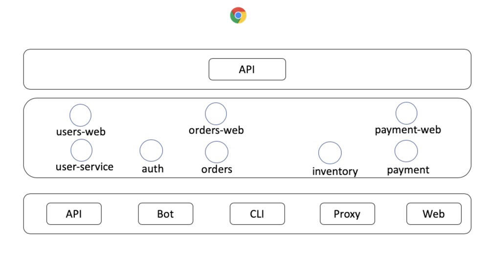

# GoMicroBookshop
A bookshop project for my go-micro and micro service learning

本项目依据项目 [micro-in-cn](https://github.com/micro-in-cn/tutorials/tree/master/microservice-in-micro) 进行学习。

## 目录

[TOC]

# 项目简介

## 业务模块

+ **用户**，users
+ **库存**，inventory
+ **权限**，auth
+ **订单**，orders
+ **支付**，payment

## 服务抽象结构



用户、订单、支付服务都会有对外暴露接口，故而它们各自有web层。web层app之间不会互相调用，它们只会与非web层的应用交互。

## 准备工作

- Golang环境 [安装](https://golang.google.cn/)
- gRPC [安装](https://grpc.io/docs/quickstart/go.html)
- Micro

```shell
## 安装go-micro
go get github.com/micro/go-micro

## 安装micro
go get github.com/micro/micro
```

- mysql

还有其它一些会用到的库或组件，但不是基础依赖，需要时再安装。

## 涉及技术与库

Golang，gRPC，Mysql，Redis，Docker，K8s，Go-micro/Micro

